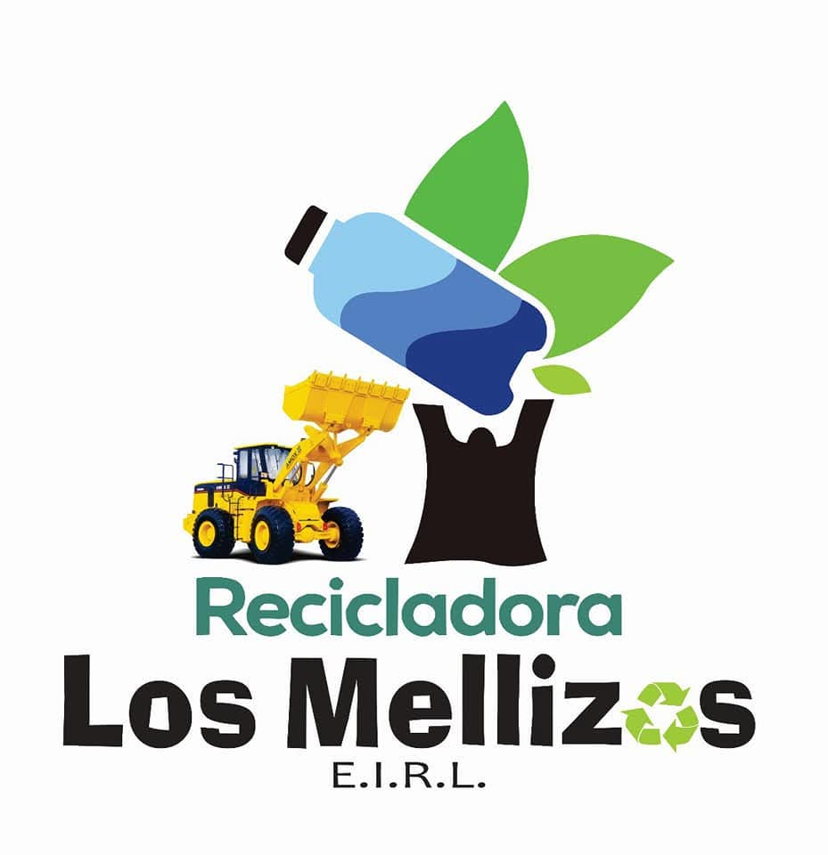
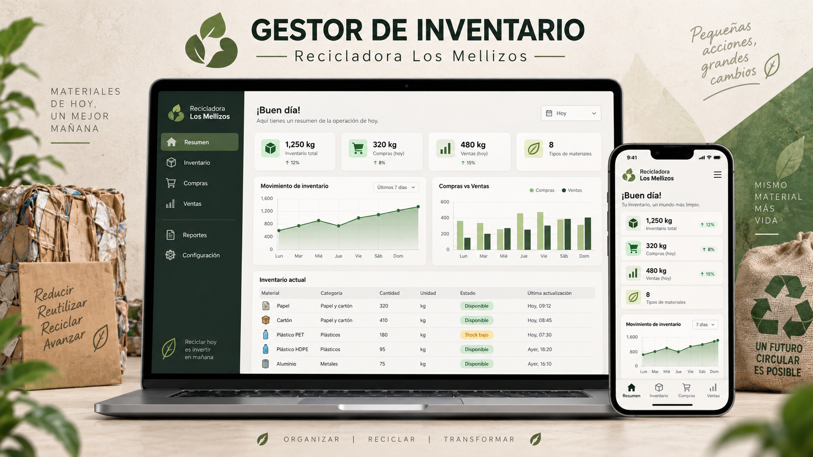
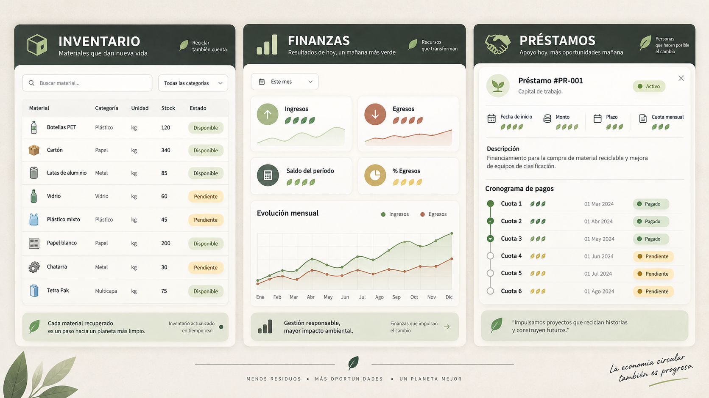
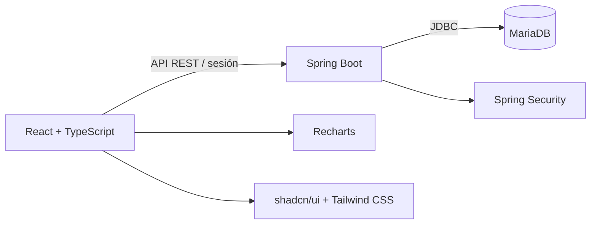

  

  # Recicladora Los Mellizos

  **Plataforma integral para controlar inventario, operaciones, personas y finanzas.**

  
  
  
  
  

  Diseñado para ofrecer una lectura clara del negocio desde cualquier dispositivo.

  

---

## Acerca del proyecto

Recicladora Los Mellizos es un sistema web de gestión creado para centralizar las actividades diarias de una recicladora. Conecta las compras, ventas, materiales, personas, movimientos financieros y préstamos para evitar registros aislados y ofrecer información útil en tiempo real.

La interfaz utiliza una identidad visual en tonos beige y gris oscuro, navegación adaptable y componentes intuitivos. El panel principal presenta indicadores, alertas y gráficos para conocer rápidamente la situación del negocio.

> Este es el repositorio público de presentación. El código fuente, la configuración interna y los datos de la empresa permanecen en un repositorio privado.

## Una sola plataforma para todo el negocio

  

| Control operativo | Información conectada | Decisiones claras |
|:---:|:---:|:---:|
| Compras, ventas e inventario | Personas, pagos y préstamos | Indicadores, alertas y gráficos |

## Funciones principales

| Módulo | Funciones |
|---|---|
| **Resumen** | Indicadores generales, balance estimado, gráficos y alertas operativas. |
| **Inventario** | Entradas, salidas, existencia calculada, stock mínimo e historial de precios. |
| **Compras** | Compras al contado o crédito, proveedores, pagos, saldos y vencimientos. |
| **Ventas** | Ventas vinculadas a clientes, materiales, cobros parciales y estados de pago. |
| **Personas** | Gestión unificada de clientes, proveedores, socios y su actividad relacionada. |
| **Finanzas** | Ingresos, egresos y saldos separados por caja, banco o billetera digital. |
| **Préstamos** | Capital, intereses, cronograma de cuotas, pagos parciales y alertas de mora. |

### Experiencia de uso

- Diseño responsive para computadoras, tablets y teléfonos.
- Formularios conectados: las personas y los materiales se reutilizan entre módulos.
- Tablas con filtros, estados visuales y acceso al detalle de cada registro.
- Colores contextuales para reconocer operaciones pagadas, pendientes o vencidas.
- Sesión protegida para el administrador mediante Spring Security y BCrypt.
- Historial de precios y registro de auditoría para operaciones relevantes.

## Arquitectura

## Tecnologías utilizadas

**Frontend:** React 19, TypeScript, Vite, Tailwind CSS, shadcn/ui, Radix UI, Lucide Icons y Recharts.

**Backend:** Java 21, Spring Boot 3.5, Spring Web, Spring JDBC, Spring Security, Bean Validation y Maven.

**Datos:** MariaDB con tablas relacionales, movimientos financieros, pagos, cuotas, historial de precios y auditoría.

## Seguridad y privacidad

Este repositorio no debe incluir contraseñas, archivos `.env`, respaldos de la base de datos ni información real de clientes. Antes de desplegar el sistema, se recomienda utilizar variables de entorno, habilitar HTTPS y revisar las políticas de acceso y respaldo.

## Estado

El proyecto se encuentra en desarrollo activo. La versión actual integra los módulos principales y el flujo relacionado de registros, pagos y consultas detalladas.

---

  Desarrollado para <strong>Recicladora Los Mellizos</strong> · Gestión clara, conectada e intuitiva.

